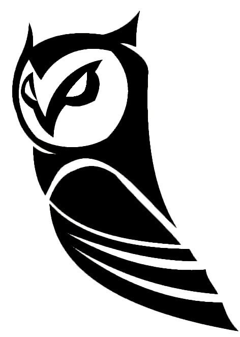
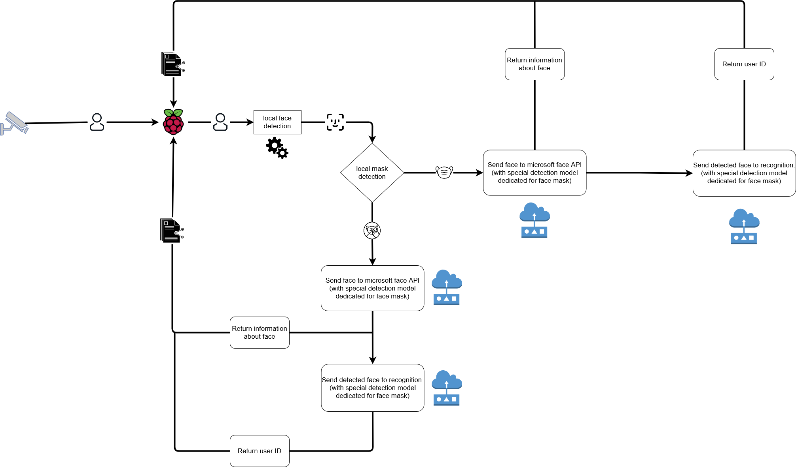

# IoT Owl
</img>  
IoT owl is light face detection and recognition system made for small IoT devices like raspberry pi.

## Versions
Heavy
- with mask detection
- without mask detection 

More in the future

## How does it work?
Heavy version:
1. Raspberry pi analyzes every video frame streamed from the camera
2. If program detects faces in the frame collects next 10  frames (in the default config, you can change this value) and choice best one then crop face from the best frame
3. \[optional\] detects mask on the face
4.  Sends cropped face to Microsoft API to encode face and get information about it (for example: hair color, emotion, checks is mask put correctly for all option check bellow)
5.  Sends returned token with detected face to recognition person
6.  Check information about student in local database by returned from cloud person id




## Requirements
Minimal for heavy version:  
* python 3 interperter  
* camera (can be wireless)  
* space on disk (this value depends on how many users we want to recognize and how much information about them, we want to store, additionally is highly possible that you have already installed some of this libraries)
	* 1MB - database with information about users
	* 30MB - models if we want to detect persons with masks 
	* 10MB - CVlib
	* 22MB - Matplotlib
	* 200MB - OpenCV
	* 1200MB - Tensorflow
	total: 1463MB
 
 
Recommended: 
* internet connection (faster internet = faster face recognition)<br><br>

## Benchmarks
```diff
Heavy version:
________________________
- download: 150Mbps 
+ upload: 140Mbps
0.6s ~ 0.9s

________________________
- download: 134Mbps 
+ upload: 105Mbps
0.7s ~ 1.2s

________________________
- download: 12Mbps 
+ upload: 4Mbps
1.2s ~ 1.9s
```

## How to use
Setup:  
1. You **have to** set in configuration file:
- [microsoft API key](https://azure.microsoft.com/en-us/services/cognitive-services/face/)
- Microsoft endpoint links with parameters  - IP of the camera or number if it's connected directly to PC (default is "0")  
2. Download requirements from "requirements.txt"
3. In main file import:
 - `faceDetection.win_face_detection`
 - `os`
 - `sys`

4. Add program to PATH by: `sys.path.append(os.getcwd())`
5. Create an object of the class, run "run" function and pass to it function which will be run every time when face will be detected 


## Example

```py
import faceDetection.ms_face_detection
import os
import sys
sys.path.append(os.getcwd())


def analyzeStudent(detected_persons = []):
 print(str(data))

  

def experimental():
 print("start")
 test = faceDetection.ms_face_detection.APIFaceDetection()
 test.run(analyzeStudent)


if __name__ == "__main__":
 experimental()

```

## Example output
```json
[
    [
        {
            "confidence": 0.5445673,
            "faceAttributes": {
                "accessories": [],
                "emotion": {
                    "anger": 0.0,
                    "contempt": 0.001,
                    "disgust": 0.0,
                    "fear": 0.0,
                    "happiness": 0.902,
                    "neutral": 0.098,
                    "sadness": 0.0,
                    "surprise": 0.0
                },
                "facialHair": {
                    "beard": 0.1,
                    "moustache": 0.1,
                    "sideburns": 0.1
                },
                "glasses": "NoGlasses",
                "smile": 0.902
            },
            "faceId": "0d56aee7-946a-4450-b1b5-563b5266b129",
            "faceRectangle": {
                "height": 138,
                "left": 44,
                "top": 60,
                "width": 138
            },
            "recognitionModel": "recognition_01",
            "userData": "\"Filip\"\"Poplewski\"\"3iT\"\"10:11:2003\""
        }
    ]
]
```
```
example greeting:
["Good morning ['Filip']"]
````

```json
[
    [
        {
            "confidence": 0.78242,
            "faceAttributes": {
                "headPose": {
                    "pitch": -2.0,
                    "roll": -2.1,
                    "yaw": 18.7
                },
                "mask": {
                    "noseAndMouthCovered": false,
                    "type": "otherMaskOrOcclusion"
                }
            },
            "faceId": "66388a5c-ef86-484e-8319-b7010d782a92",
            "faceRectangle": {
                "height": 202,
                "left": 41,
                "top": 52,
                "width": 148
            },
            "recognitionModel": "recognition_04"
        }
    ]
]

```
  

## Argument passed to given function

APIFaceDetection will run provided as argument function every time when it detect face at the frame.  
APIFaceDetection pass JSON with all collected data about person in the image to given function  variable named "detected_persons".  
Examples of all three JSON's you can find in "response.txt"

## Debugging and configuration

If you want to configure face detection to your camera you can run version made for debugging. Everything what you need to do is change:  

`import faceDetection.ms_face_detection`
to `import faceDetection.DEBUG_ms_face_detection`  
  
 and `faceDetection.ms_face_detection.APIFaceDetection()`
to `faceDetection.DEBUG_ms_face_detection.APIFaceDetection()`

It will display window with:
- camera view,
- detected face
- cropped face
- response 
- time to next face recognition
- face quality in percents


## Issue?
If you have any questions or you need help in implementation write to me :)  
email:   filip.poplewski@protonmail.com 
